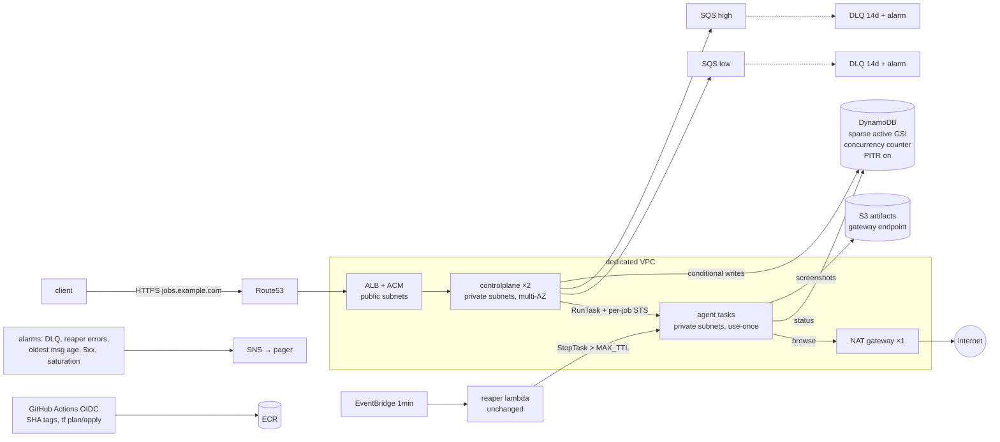

# Production Architecture

## 0. What this is

The take-home already runs; this document is the delta between that and a system you'd let strangers pay for. The main body designs for **small real prod** — 1–10k jobs/day, tens of concurrent agents, one region. §10 sketches the 100k+/day evolution. The ordering principle carries over from the [RUNBOOK](RUNBOOK.md): correctness → reachability → redundancy → cost optimization, never the reverse.

## 1. What deliberately does not change

The rewrite instinct was resisted. These parts are already prod-grade patterns and survive intact:

- **The DynamoDB conditional-write state machine** (`internal/store`). Every transition (`QUEUED → LAUNCHING → RUNNING → terminal`) is a conditional update; it *is* the idempotency mechanism under SQS at-least-once — and it is already multi-writer-safe, which Phase 2 exploits directly.
- **The 3-layer reaper**, especially the ECS-state-only Lambda (layer 3). It depends on nothing — not DynamoDB, not the controlplane — and is the hard guarantee that no task outlives `MAX_TTL`. That's the cost ceiling; it stays exactly as is.
- **IAM role separation.** The agent role can `s3:PutObject` its artifacts and read/update job rows — nothing else. Controlplane, execution, and reaper roles are similarly scoped (`terraform/iam.tf`).
- **Two-queue priority, job-id-only messages.** SQS carries a ULID; DynamoDB is the source of truth. Poll high before low. No change.
- **Ephemeral task-per-job isolation.** Fresh Fargate task, no shared filesystem or memory between jobs. The warm pool (§10) must preserve use-once semantics — a pool of *reusable* agents would be a different, worse product.
- **Polling log tail, single DDB table, flat Terraform.** Modules arrive with a second environment, not before.

## 2. Correctness fixes first

A prod plan that misses real bugs is decoration. Code review for this doc found four; three are invisible in the demo and only bite under production traffic.

| # | Bug | Fix | Phase |
|---|-----|-----|-------|
| 1 | The reconciler's `ListNonTerminal` scan filter (`NOT status IN terminal`) matches `ratelimit#` rows — they have no `status` attribute, so the filter is true. They unmarshal as empty jobs, fall into the launch-deadline branch (`internal/reap/reap.go:86–97`), and get a garbage `FAILED` status written onto rate-limit keys within 30s of creation. | Interim: skip `ratelimit#`-prefixed ids (2 lines). Structural: the sparse GSI (D5) — rate-limit rows never enter the index. | 1 / 2 |
| 2 | Poison path: if `GetJob` keeps erroring or a non-conflict transition error occurs, the message dead-letters after 3 receives while the job stays `QUEUED`. The reconciler explicitly skips `QUEUED` (`reap.go:83–84`), nothing consumes the DLQs, and the DLQs use SQS's default 4-day retention — so the evidence evaporates and the job is stranded forever. | Reconciler fails `QUEUED` jobs older than the 6h message retention — past that the message provably cannot redeliver. Plus D16: 14-day DLQ retention + depth alarm for the window before. | 1 |
| 3 | Fixed-window rate limiter allows a 2× burst at window edges (self-flagged in `internal/store/store.go:179`). | Token bucket. At 10/min the burst is 20 requests — a documented ceiling, not an incident. | 4 |
| 4 | Slot release lags job completion by up to 15s (`trackInflight` polls DDB every 15s, `internal/dispatch/dispatch.go:205`) — roughly 6–12% throughput loss at saturation on 1–2 minute jobs. | EventBridge task-state fast path (D6) shrinks it to ~1s. Not worth touching at small tier. | 4 |

## 3. Target architecture (small real prod)

A job's path: client hits `https://jobs.example.com` through the ALB (TLS terminates at ACM), the API validates the JWT and writes the record + enqueues. A dispatcher on either controlplane replica claims it via the conditional write, takes a slot from the DynamoDB concurrency counter, and launches an agent task in a private subnet with STS credentials scoped to that job. The agent browses through the NAT, writes frames to S3 through the free gateway endpoint, and finishes. The reconciler and reaper Lambda are unchanged.

What changed vs. today, and the specific weakness each change removes:

- **ALB + ACM + Route53** → replaces `http://<ephemeral-task-ip>:8080` whose IP rotates every deploy and whose SG allowlist defaults to `0.0.0.0/0` if you forget a `-var`.
- **Dedicated VPC, private subnets, no public IPs** → today every task has a public IP in the default VPC.
- **DDB concurrency counter** → replaces the in-memory semaphore that silently doubles the global cap at 2 replicas and forgets everything on restart.
- **Controlplane ×2 across AZs** → today a crash pauses dispatch *and* layer-2 reconciliation until ECS restarts the single task.
- **Sparse `active` GSI** → replaces the full-table scan (and structurally kills bug 1).
- **Per-job STS credentials** → today all agents share one task role; any agent can write any job's artifacts and rows.
- **SHA-tagged images via CI** → replaces `:latest` from a laptop with local Terraform state.
- **Alarms** → today the "page a human" signal (DLQ depth) is documented but not wired to anything.

## 4. Decisions

### D1 — Front door: ALB, not API Gateway

ALB + ACM certificate + Route53 record, target group on the existing ECS service, health check on the `/healthz` that's already unauthenticated (`internal/api/api.go`). Auth already lives in the `requireAuth` middleware, so API Gateway's authorizers, per-request pricing, 29-second integration timeout, and VPC-link plumbing buy nothing. Kill the `allowed_cidr` variable — its default is `0.0.0.0/0`, which makes the current "SG-scoped to deployer IP" one forgotten `-var` away from an open, unauthenticated-transport port. ~$21/mo.

### D2 — Egress: one NAT gateway + free gateway endpoints

Agents browse the arbitrary internet, so VPC-endpoints-only is not an option — NAT is mandatory. The cost math that matters: ECR layer blobs are served from S3, so a **free S3 gateway endpoint** takes the ~100MB-per-job image pull off the NAT — at 5k jobs/day that's ~$22/day of NAT data processing avoided. DynamoDB gateway endpoint: also free, also on. What's left crossing the NAT is actual browse traffic (~10MB/job ≈ $70/mo at 5k/day) plus small API chatter. Interface endpoints ($7.30/mo/AZ each, ~5 services) are dismissed at this tier: they cost more than the traffic they'd save.

### D3 — Distributed concurrency cap: DynamoDB atomic counter

One item, `concurrency#global` — the `ratelimit#` prefix convention already proves non-ULID keys coexist safely in this table. Claim = `ADD active :1` with condition `active < :max`, taken exactly where `d.sem <- struct{}{}` sits today (`dispatch.go:61`); release = `ADD active :-1` where `trackInflight` frees slots. This is the same conditional-write idiom the codebase already trusts for job claiming.

The failure mode, honestly: a dispatcher crash between increment and `RunTask`, or a lost decrement, leaks counter capacity. The heal: the reconciler already computes ground truth every 30s (non-terminal jobs × ECS task state), so it writes `SET active = :observed` each pass — leaks self-clear in ≤30s, and any transient overshoot in that window is bounded by the layer-3 Lambda anyway.

Dismissed: per-slot lease items (N items of machinery for the same guarantee); queue sharding with static per-dispatcher caps (strands capacity when one dispatcher idles, and breaks high-before-low draining across shards).

### D4 — Dispatcher HA: active-active, no leader election

The key observation: the `QUEUED → LAUNCHING` conditional claim (`dispatch.go:129`) is *already* multi-dispatcher-safe — SQS distributes messages, the conditional write dedupes, and only the in-memory semaphore is process-local. D3 removes it. So: `desired_count = 2`, zero coordination code. The reconciler runs on both replicas too; every action it takes is idempotent (`Finish` is conditional, `StopTask` is idempotent), so a duplicate pass costs a redundant query, not a wrong write. Leader election is dismissed: it adds a split-brain failure mode to solve a problem the state machine already solved.

### D5 — GSI: sparse `active` index, not a status-keyed one

GSI partition key = a constant attribute `active = "1"`, sort key = `created_at`. Written in `CreateJob`, `REMOVE active` in the same update expression as `Finish`. Terminal jobs and `ratelimit#` rows never appear in the index, so the reconciler's full-table scan (`store.go:151` — the code's own `ponytail:` comment names this exact upgrade) becomes one Query, and bug 1 becomes structurally impossible. Honest ceiling: a single-value partition key caps at one partition's throughput — fine to hundreds of thousands of concurrently active jobs; shard to `active#0..9` when scale demands (§10). A status-keyed GSI is dismissed: three queries instead of one, and it indexes terminal jobs forever.

### D6 — Reconciliation: keep the 30s poll; EventBridge is a scale-tier fast path, never the only path

EventBridge ECS task-state-change events are at-least-once with no delivery-latency guarantee, so the poller must exist regardless — which means at small tier EventBridge adds a component without removing one. At scale it earns its place: crashed-agent detection drops from ≤30s to ~1s and slot-release lag (bug 4) from ≤15s to ~1s, with the poller demoted to a 2-minute sweeper for dropped events. Event-driven-only reconciliation is the classic way to strand jobs silently.

### D7 — Per-job credentials: controlplane-vended STS with inline session policies

At `RunTask` time the dispatcher calls `sts:AssumeRole` on a new agent-base role with an inline session policy: `s3:PutObject` on `${bucket}/${job_id}/*` and DynamoDB `Get/UpdateItem` with `dynamodb:LeadingKeys = ["${job_id}"]`. The credentials ride the same `ContainerOverride.Environment` that already carries `JOB_ID` (`dispatch.go:182–187`). STS's 15-minute session minimum conveniently exceeds `MAX_TTL = 10m`, so mid-job expiry is impossible by construction. Exposure via `ecs:DescribeTasks` is IAM-gated and the creds are dead in ≤15 minutes; accepted. Dismissed: per-job IAM roles (API limits + garbage collection); agent-pulls-creds-from-controlplane (opens an agent→controlplane network path that currently doesn't exist and shouldn't).

### D8 — Agent egress control: SG-level now, Network Firewall priced but not bought

Ranked prompt-injection blast radius (see §5): internal pivot is killed for free by an agent SG egress rule denying the VPC CIDR (today it's egress-all) plus private subnets — and Fargate has no IMDS to steal from, worth stating. Attacking the internet from our NAT IPs is accepted at small tier, abuse contact on the EIPs. AWS Network Firewall with domain allowlisting is real money (~$285/mo + $0.065/GB) and only coherent if the product can constrain browse targets — priced in §10, not bought now. A TLS-inspecting proxy is dismissed in one line: it breaks half the web and you become a CA; that's two products.

### D9 — Auth: keep the JWT, move the secret; OIDC when there are external users

`internal/auth` and the `sub`-derived identity/ownership/rate-key already give the right seams; swapping HS256-shared-secret for RS256-against-JWKS is a ~50-line change inside one package whenever a real issuer exists. The actual current vulnerability is the secret living in Terraform state and plaintext task-def env (readable via `ecs:DescribeTaskDefinition`) — fixed by generating it out-of-band into an SSM SecureString and using the task-def `secrets` block. Cognito now is gold-plating: migrating auth providers before having users. Secrets Manager: $0.40/secret/mo for rotation machinery nobody asked for; SSM standard tier is free.

### D10 — Multi-AZ: two controlplane tasks, one NAT, one region

Controlplane ×2 across AZs behind the ALB — which needs D3 first; that dependency is why Phase 2 is ordered after Phase 1. Agents spread across 2–3 private subnets. DynamoDB/SQS/S3 are already regional. **One NAT, deliberately**: lose that AZ and agents everywhere lose egress until it recovers — jobs fail, the reconciler cleans up, the queue absorbs retries. A second NAT is $33/mo of insurance bought at scale tier, not before. Single region, full stop; multi-region appears only as §10's cellular sketch.

### D11 — Artifacts: presigns stay, bucket policy hardens, no versioning, no KMS

The 15-minute presigned GET is right — clients re-fetch the listing for fresh URLs. Add an `aws:SecureTransport` deny to the bucket policy, drop `force_destroy`, and make the 7-day lifecycle a variable — compliance owns that number, not the code. Versioning: dismissed — screenshots are immutable write-once and jobs are re-runnable; versioning doubles storage for zero recovery value. KMS-CMK: dismissed with a number — a screenshot every 5 seconds makes per-request KMS charges a tax on the flight recorder; SSE-S3 is already on.

### D12 — Observability: EMF from the existing slog output; no agents, no tracing

Both binaries already emit structured JSON via `slog` to the awslogs driver; CloudWatch EMF means metrics are just log lines — zero new runtime components. Metric set: dispatch latency, slot-wait time, active count vs cap, reconciler repairs by type, TTL reaps, launch failures. `ApproximateAgeOfOldestMessage` and Lambda errors come free. Alarms are the RUNBOOK P1 list, now actually built: DLQ depth > 0, reaper Lambda errors > 0, `RunningTaskCount` < 1, API 5xx rate, oldest-message age, sustained saturation at `MAX_CONCURRENT` — all → SNS → pager. X-Ray: dismissed — the trace of a job already exists as the job record, a deterministic log stream, and timestamped flight-recorder frames; distributed tracing across a linear one-hop pipeline is plumbing without questions it can answer.

### D13 — CI/CD: GitHub Actions OIDC, SHA tags, pinned revisions, remote state

Pipeline: test → build ARM64 images tagged with the git SHA → push → `terraform plan` on PR, `apply` on merge, `image_tag` as a variable. Rollback = re-apply the previous SHA. Two codebase-specific traps this fixes: `:latest` means a controlplane restart can silently pick up a newer image, and `AGENT_TASK_DEF` is passed as a bare family — "family alone = latest revision" (`terraform/ecs.tf`) — so a deploy mid-backlog silently flips agent versions for already-queued jobs. Pin the full task-definition revision ARN. State: S3 backend with `use_lockfile` (Terraform ≥ 1.10 — no DynamoDB lock table needed). ECR: scan-on-push, drop `force_delete`, lifecycle keep-last-20.

### D14 — DynamoDB capacity: on-demand at both tiers

10k jobs/day × ~8 writes/job ≈ $3/mo; even 100k/day is ~$40/mo. Provisioned-with-autoscaling would halve a number that small in exchange for throttle-tuning ops. Revisit only if the bill says so. Closed.

### D15 — Fargate Spot on the low queue only

Short jobs (≤5m TTL) are the ideal Spot workload: low interruption probability, cheap retry. Change `RunTask` (`dispatch.go:169`) from `LaunchType` to a capacity-provider strategy keyed on the job's priority. The reconciler already *detects* reclaim (STOPPED task + non-terminal job) but currently marks it `FAILED` — teach it to recognize the Spot interruption stop code and transition back to `QUEUED` + re-enqueue, bounded by a `retry_count` attribute to prevent loops. The high queue stays on-demand; that's what priority means. ~70% off the low-queue compute line.

### D16 — DLQs: 14-day retention, depth alarm, no auto-redrive

Today nothing consumes the DLQs *and* they silently drop messages after SQS's default 4 days (`terraform/sqs.tf` sets no retention) — the evidence of a poison job evaporates. Fix: 14-day retention, depth > 0 alarm, and the reconciler `QUEUED` age-out from bug 2 as the correctness backstop. Redrive stays a human action (the RUNBOOK already documents it): auto-redriving a poison message is a loop with extra steps.

## 5. Security posture and trust boundaries

| Boundary | Enforced by |
|---|---|
| internet → API | ALB + ACM TLS; WAF rate rule; JWT validation in `requireAuth` |
| JWT subject → resources | Ownership + rate key from verified `sub`; cross-user reads 404 |
| controlplane → AWS | Task role: queues, table, `RunTask` on the agent family, `PassRole` on exactly two roles |
| agent → everything | Per-job STS session policy; private subnet; SG deny-to-VPC; no IMDS on Fargate |

The centerpiece is the agent: **it is untrusted the moment Chromium loads a page.** A prompt-injected or malicious page is arbitrary influence over a process holding AWS credentials inside your VPC. The design question is not "how do we prevent injection" (you can't) but "what can a hijacked agent reach":

1. **Its own credentials** — reduced by D7 to one S3 prefix and one DynamoDB row, dead in ≤15 minutes.
2. **The internal network** — killed by private subnets + SG egress deny-to-VPC-CIDR. There is no agent→controlplane path and none should be added.
3. **The internet, from our IPs** — accepted at small tier; Network Firewall is the priced upgrade (D8, §10).

Plus: artifacts bucket blocks public access with a TLS-only policy (D11), secrets ride SSM SecureStrings (D9), images are scanned on push (D13).

## 6. Failure modes

Extending the README's table with the rows the new topology introduces:

| Failure | Automatic behavior | Residual |
|---|---|---|
| One controlplane replica dies | Other replica keeps dispatching; ALB drains the target | none |
| AZ loss (controlplane AZ) | Survivor replica in other AZ carries load | none |
| AZ loss (NAT AZ) | Agents lose egress; jobs fail; reconciler cleans; queue absorbs resubmits | manual: rerun failed jobs; upgrade: 2nd NAT (§10) |
| Spot reclaim (low queue) | Reconciler sees Spot stop code → re-queue, `retry_count`-bounded | none |
| Concurrency counter leak (dispatcher crash) | Reconciler resets counter to observed truth ≤30s | none |
| EventBridge event lost (scale tier) | 2-min poller sweep catches it | none |
| Poison message | 3 receives → DLQ (14d) + depth alarm; reconciler fails the stranded `QUEUED` job after 6h | human: inspect DLQ, redrive or drop |
| Both replicas down | Dispatch pauses; jobs queue safely (6h retention); L3 Lambda still enforces `MAX_TTL` | page: `RunningTaskCount` alarm |

## 7. SLOs and alarms

| SLO | Target | Measured from |
|---|---|---|
| API availability (30d) | 99.9% — 99.95 would be dishonest for single-region ×2 tasks | ALB metrics |
| Time-to-task (accepted → RUNNING, high queue, below cap) | p50 ≤ 60s, p95 ≤ 120s (warm pool tier: p50 ≤ 5s, p95 ≤ 30s) | `started_at − created_at`, already on every job record |
| No-zombie guarantee | 99.99% of launched jobs terminal within `MAX_TTL` + 2min | GSI query for over-age active jobs — this metric *is* the L2/L3 health check |
| Artifact retrieval | 99.9% availability; durability inherits S3's 11 nines | `/artifacts` non-5xx |
| Flight-recorder completeness | ≥95% of expected frames (duration ÷ 5s) on succeeded jobs | frame count vs duration, both already recorded |

Error-budget policy in one sentence: DLQ depth > 0, reaper-Lambda errors > 0, and zombie count > 0 page immediately regardless of remaining budget — they are correctness signals, not latency signals.

## 8. Rollout

Phases 0–3 total roughly **12 engineer-days**. Everything is additive; the only downtime is the VPC cutover in Phase 1, and the queue's 6h retention absorbs it — jobs queued during the cutover dispatch after.

- **Phase 0 — Stop the bleeding** (1–2 days). S3 remote state + lockfile; SHA-tagged images + pinned agent task-def revision; DynamoDB PITR + deletion protection; drop `force_destroy`/`force_delete`; `JWT_SECRET` → SSM; DLQ retention 14d. *Unblocks everything — no later phase is safe to deploy on `:latest` from a laptop with local state.*
- **Phase 1 — Front door + correctness** (3–4 days). Dedicated VPC: private subnets, one NAT, S3+DDB gateway endpoints, `assign_public_ip = false`; ALB + ACM + Route53, delete `allowed_cidr`; agent SG deny-to-VPC; bug 1 guard + bug 2 age-out; GitHub Actions pipeline. *Unblocks Phase 2: two tasks need a load balancer, and safe deploys need CI.*
- **Phase 2 — Two of everything** (3–4 days). DDB concurrency counter + reconciler heal (D3); `desired_count = 2` multi-AZ (D4); sparse `active` GSI (D5); EMF metrics + full alarm set + one dashboard (D12). *After this, `MAX_CONCURRENT` is finally a real global invariant instead of a per-process accident.*
- **Phase 3 — Locked doors + cheaper compute** (3–5 days). Per-job STS (D7); artifacts bucket policy (D11); ECR scan-on-push; ALB rate-based WAF rule only — managed rule groups are SQLi noise on a JSON-only JWT API; Fargate Spot on the low queue + reclaim-requeue (D15).
- **Phase 4 — Scale tier.** Not scheduled; triggered by numbers: sustained >30 concurrent or >20k jobs/day. Contents in §10.

## 9. Cost, honestly

us-east-1, ARM64 Fargate ($0.0395/hr per 1 vCPU + 2GB agent-task-hour):

| Line | Today (demo) | Small prod (5k jobs/day, ~2min jobs) | Scale (100k jobs/day) |
|---|---|---|---|
| Controlplane | $9 (×1) | $18 (×2) | $40 |
| Agent compute | ~$0 | $200 → **~$160 with Spot** | $4,000 → ~$2,900 with Spot |
| Warm pool | — | — | $600–1,500 |
| ALB (+ WAF rule) | — | $26 | $60 |
| NAT + data | — | $53 | $1,400 ← the scale-tier problem line |
| DynamoDB | ~$0 | $5 | $50 |
| S3 (PUTs dominate: ~24 frames/job) | ~$0 | $20 | $400 |
| CloudWatch | ~$0 | $20 | $200 |
| SQS, EventBridge, Route53, misc | ~$0 | $5 | $30 |
| **Total /mo** | **~$9** | **~$310–360** | **~$5,600–6,600** |

Unit economics: ~$0.002–0.003/job at both tiers. Compute is ~60%, NAT data ~20%, S3 PUTs ~7%. Two traps deliberately avoided: ECR pulls through the NAT (the free S3 gateway endpoint saves ~$22/day at 5k jobs/day — without it, NAT data processing would exceed the compute bill), and KMS-CMK on the flight recorder (a per-request charge every 5 seconds).

## 10. When scale demands (100k+/day, hundreds concurrent)

- **Warm pool.** Pre-launched paused agent tasks cut time-to-task ~45s → ~2s. Must stay use-once: a task serves one job, then dies. Conflict to solve: per-job STS creds are injected at `RunTask` (D7), but pool tasks launch *before* job assignment — creds move to a vend-at-assignment call, which means a minimal, authenticated agent→controlplane endpoint that D7 explicitly avoided. That tradeoff is the price of the warm pool; make it consciously.
- **EventBridge fast path** (D6): task-state events drive reconciliation and slot release (~1s); the poller demotes to a 2-minute sweeper. Fixes bug 4.
- **Sharded GSI**: `active` → `active#0..9` (job-id hash), reconciler queries all shards. Removes the single-partition ceiling from D5.
- **Token-bucket rate limiter** (bug 3), still as DDB conditional writes.
- **Quotas before code**: Fargate on-demand vCPU quota and `RunTask` API throttles are the real ceiling past `MAX_CONCURRENT` ≈ 50 — request increases first, then tune.
- **Second NAT** ($33/mo): removes the single-AZ egress ceiling named in D10.
- **Network Firewall revisit** (D8): only if the product can constrain browse targets to an allowlist; otherwise it's $285/mo of nothing.
- **Cellular isolation**: at serious multi-tenant scale, a cell = the full stack (table, queues, cluster, VPC) per N tenants. Cheap here because the flat ~30-resource Terraform *is* the cell template already.

## 11. Appendix: considered and rejected

- **AWS Batch** — owns the queue + dispatch loop, but hides the job state machine that *is* this product's API.
- **Step Functions** — per-transition pricing for a 5-state machine DynamoDB conditional writes do for free; the reconciler would still be needed for ECS truth.
- **EKS** — fleet management is the thing task-per-job exists to avoid.
- **API Gateway** — see D1.
- **X-Ray** — see D12; the job record is the trace.
- **Secrets Manager** — see D9; SSM standard tier is free.
- **S3 versioning** — see D11; immutable write-once artifacts.
- **TLS-inspecting egress proxy** — breaks half the web, and you become a CA.
