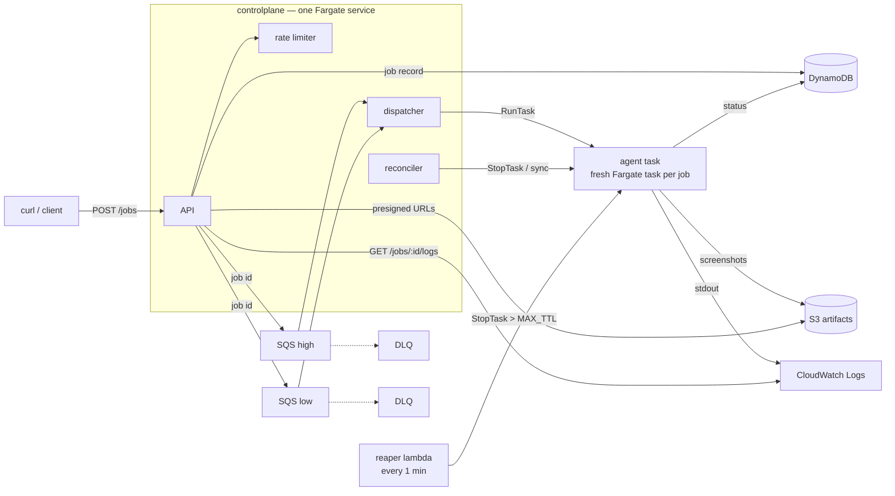

# Bravebird Take-Home — Ephemeral Computer-Use Job Runner

A backend that accepts "computer use" jobs over HTTP, provisions a **fresh Fargate task per job**, runs a placeholder browser agent (open browser → search → capture screenshots), streams its logs, uploads a screenshot-per-5s "flight recorder" trail to S3, and **destroys the environment** — with three independent layers making sure nothing outlives its TTL.



**Job lifecycle:** `QUEUED → LAUNCHING → RUNNING → SUCCEEDED | FAILED | TIMED_OUT`. Every transition is a DynamoDB conditional update — that's the idempotency mechanism that makes SQS's at-least-once delivery safe.

## Quick start

Prereqs: AWS credentials in your environment, Terraform ≥ 1.5, Docker, Go 1.26, `jq`.

```bash
make deploy        # terraform init → ECR repos → build+push images → everything else
make api-url       # prints http://<ip>:8080 (service takes ~1 min to start)
```

Trigger a job and watch it:

```bash
API=$(make -s api-url)

curl -s -X POST $API/jobs -H 'X-User-Id: demo' -H 'Content-Type: application/json' \
  -d '{"prompt":"golang generics","priority":"high"}'
# => {"job_id":"01K...","status":"QUEUED"}

curl -s $API/jobs/01K...                  # status, timings, failure reason if any
curl -s $API/jobs/01K.../logs             # tail agent logs (pass ?since=<next_since> to follow)
curl -s $API/jobs/01K.../artifacts        # pre-signed URLs for every screenshot (15-min expiry)
```

The concurrency demo — 50 simultaneous jobs, live drain histogram, then a rate-limit burst:

```bash
make loadtest
```

Tear everything down (bucket has `force_destroy`, ECR has `force_delete` — nothing survives):

```bash
make destroy
```

Local dev: `make run-local` runs the controlplane on your laptop against the real AWS resources (it's all client-side SDK calls); `make agent-local` iterates on the browser task with no AWS and no Docker at all.

## Why this stack

- **Fargate, one task per job** — real kernel-level isolation per job with zero fleet management and zero idle cost: capacity exists only while a job runs. The price is a ~30–60s cold start per job (see tradeoffs).
- **Go** — two small static binaries; the dispatcher's concurrency cap is a buffered channel, the agent and its Chromium fit in one ~100MB image layer on top of `chromedp/headless-shell`.
- **SQS + DynamoDB** — both serverless, pay-per-request, and effectively free at take-home scale. SQS gives at-least-once delivery + DLQs for free; DynamoDB conditional writes give the state machine its atomicity.
- **Terraform, flat files, no modules** — it's one environment; modules would be structure for structure's sake.

Everything idle costs ≈ **$0.30/day** (one 0.25-vCPU controlplane task). No NAT, no ALB, no RDS.

## Deep-dive 1: Concurrency & Scheduling

- **50 simultaneous requests:** the API only does two fast writes (DynamoDB + SQS), so all 50 are accepted in milliseconds. The queue absorbs the backlog; the dispatcher drains it at `MAX_CONCURRENT` (default 10) simultaneous Fargate tasks, enforced by a buffered-channel semaphore — a slot is taken before `RunTask` and released when the job reaches a terminal state. `make loadtest` shows the histogram draining.
- **Priority:** two SQS queues; the dispatcher always polls `high` before falling back to `low`. Two queues beat message attributes because SQS has no native priority — with attributes you'd have to receive a message before knowing you didn't want it yet.
- **Per-user rate limiting:** fixed-window counter in DynamoDB (`ADD count 1` with a `count < N` condition; TTL attribute auto-expires the rows). Exceeding it returns 429. *Ceiling: fixed windows allow a 2× burst at window edges; token bucket is the upgrade.*
- **Poison messages:** 3 failed receives → DLQ (per queue). DLQ depth is the "page a human" alarm signal.

## Deep-dive 2: Observability — the flight recorder

- **Session replay:** the agent screenshots the browser every 5 seconds and uploads each frame to S3 *as it goes* — a crash mid-run still leaves a replayable trail up to the moment of death. `GET /jobs/{id}/artifacts` returns 15-minute pre-signed URLs for every frame.
- **Log streaming:** agent stdout is structured JSON (`log/slog`) shipped by the `awslogs` driver; the stream name is deterministic from the task ARN, so `GET /jobs/{id}/logs?since=<cursor>` tails CloudWatch directly. Polling with the returned cursor gives a `tail -f` experience with zero extra infrastructure.
- **Hung-VM health check (bonus):** the agent bounds Chromium startup at 30s. If the browser never comes up, the job fails fast as `env_unhealthy` — the environment was dead before the task even started, and the status says exactly that.
- **Failure forensics:** when a task dies without reporting (OOM, image pull failure, crash), the reconciler copies ECS's `stoppedReason` onto the job record, so `GET /jobs/{id}` tells you *why*.

## Deep-dive 3: Cost control — three concentric reapers

| Layer | Mechanism | Survives |
|---|---|---|
| 1 | `context.WithTimeout(JOB_TTL)` inside the agent itself | agent task hang |
| 2 | Reconciler (controlplane, every 30s): DynamoDB ⇄ ECS sync; stops over-TTL tasks, fails jobs whose tasks died silently or never launched | agent crash / harness bug |
| 3 | **Independent Lambda** (EventBridge, every 1 min): `ListTasks` → `StopTask` anything older than `MAX_TTL`. No DynamoDB, no controlplane — keyed purely on ECS truth | the entire controlplane being down |

ECS has no native max-task-duration, so layer 3 is the actual hard guarantee: **even if every other line of code is wrong, no task outlives `MAX_TTL`** (default 10m). Also cost-relevant: S3 artifacts auto-expire after 7 days, log retention is 3 days, and `stopTimeout=30` gives a reaped agent 30s to flush a final screenshot and status write.

**Spot / warm pools (bonus, discussed):** the low-priority queue is the natural fit for Fargate Spot (~70% cheaper) — reclaim already *looks like* an agent crash to the reconciler ("task stopped, job not terminal"), so the handling exists; it's a capacity-provider strategy away. The opposite tradeoff — Time-to-Task — wants a warm pool of pre-launched paused tasks; that's the first thing I'd build next (see below).

## Failure modes

| Failure | Behavior |
|---|---|
| `RunTask` fails (capacity, throttle) | Message isn't deleted → SQS redelivers after the visibility timeout (natural backoff); job reverts to `QUEUED`. On the 3rd attempt the job is marked `FAILED` and the message goes to the DLQ |
| Duplicate SQS delivery | The `QUEUED→LAUNCHING` conditional write fails → message deleted, no second task launched |
| Image pull failure / container dies at boot | Task stops; reconciler surfaces ECS's `stoppedReason` on the job |
| Dispatcher crashes between claiming a job and `RunTask` | Job is stuck `LAUNCHING` with no task; reconciler fails it after `LAUNCH_DEADLINE` (redelivered messages deliberately skip non-QUEUED jobs) |
| Agent crashes mid-run | Terminal status write is lost → reconciler sees STOPPED task vs non-terminal job → `FAILED`; screenshots up to the crash are already in S3 |
| Chromium hangs before the task starts | 30s boot deadline → `env_unhealthy` |
| Flaky network | AWS SDK adaptive retry mode on every client; ECS restarts the controlplane service if it dies |
| All of the above at once | Layer-3 Lambda still kills every over-age task |

## Security posture (README-tier by design)

Done: separate IAM task roles — the agent can only `s3:PutObject` artifacts and read/update job records; it cannot launch tasks, read queues, or see other jobs' credentials. Agent security group has **zero ingress**. Each job gets a fresh task: no shared filesystem, no shared memory between Job A and Job B. Artifacts bucket blocks all public access; URLs are short-lived presigns. No secrets in images or task definitions.

Next in prod: API authentication (the `X-User-Id` header is trusted today), per-job STS credentials scoped to the job's S3 prefix, egress allowlisting through a filtering proxy, private subnets + VPC endpoints (see tradeoffs).

## Tradeoffs, honestly

- **Public subnets, no NAT:** a NAT gateway is ~$32/mo idle — the single most expensive resource this design could have — for zero demo value. Prod: private subnets + NAT (or VPC endpoints for ECR/S3/DynamoDB/logs) and no public IPs on tasks. On EC2 you'd also block IMDS; Fargate tasks get task-role credentials without an instance metadata service to firewall.
- **No ALB:** the API is one task reached by its public IP (`make api-url`), SG-restricted to your IP. Prod: ALB + ACM + a stable DNS name.
- **Single dispatcher:** the in-memory semaphore assumes one controlplane instance. Honest ceiling; the upgrade is dispatchers sharded per queue or a DynamoDB lease.
- **Poll-based log tail** vs WebSocket/CloudWatch Live Tail: chose zero infra; the cursor API makes a follow-mode client trivial.
- **Reconciler scans** the table for non-terminal jobs: fine to ~10k jobs; sparse GSI on `status` is the upgrade.
- **Placeholder agent searches Wikipedia**, not Google/DuckDuckGo — both bot-wall headless Chromium (DuckDuckGo literally asked the agent to identify pictures of ducks). The assignment evaluates the infrastructure, so the task target just needs to be deterministic.

## What I'd build next

1. **Warm pool** — keep N paused agent tasks pre-launched to cut Time-to-Task from ~45s to ~2s; the dispatcher hands a job to a warm task instead of `RunTask`.
2. **Fargate Spot capacity provider** on the low-priority queue.
3. **EventBridge ECS task-state-change events** → replace the 30s polling reconciler with push.
4. **Session-replay UI** — the S3 frames are already an ordered timeline; a static page + presigned URLs = scrubber.
5. Real auth, per-job STS creds, private networking (above).

## Repo map

```
cmd/controlplane   API + dispatcher + reconciler (one binary, three goroutines)
cmd/agent          runs inside the ephemeral task; -local mode for laptop iteration
cmd/reaper         the layer-3 Lambda
internal/store     DynamoDB state machine + rate limiter
internal/dispatch  weighted queue polling, semaphore, RunTask, idempotency
internal/reap      reconciler + hard reaper (shared with the Lambda)
internal/agentrun  chromedp task + flight recorder + boot health check
terraform/         flat, one environment, ~25 resources
scripts/           api-url, run-local env, loadtest
```
